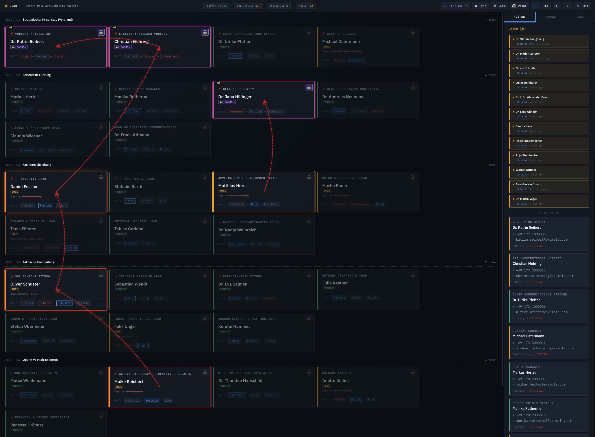
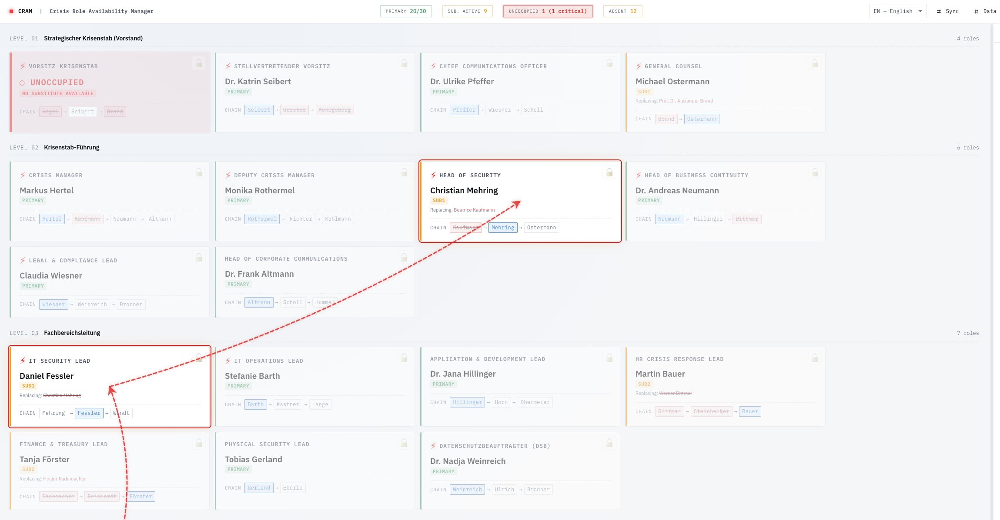
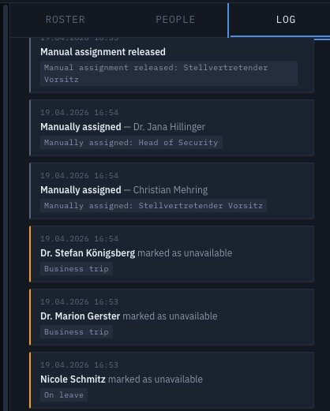
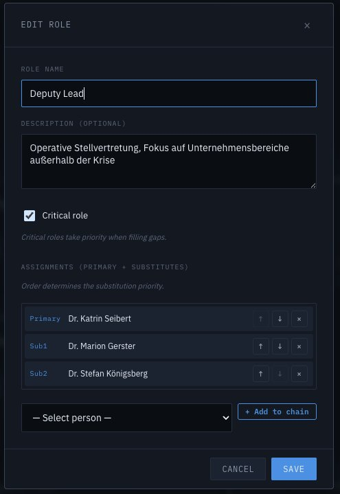
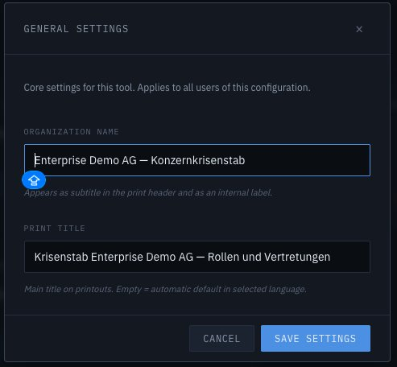
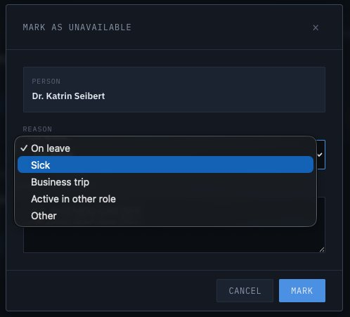
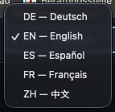
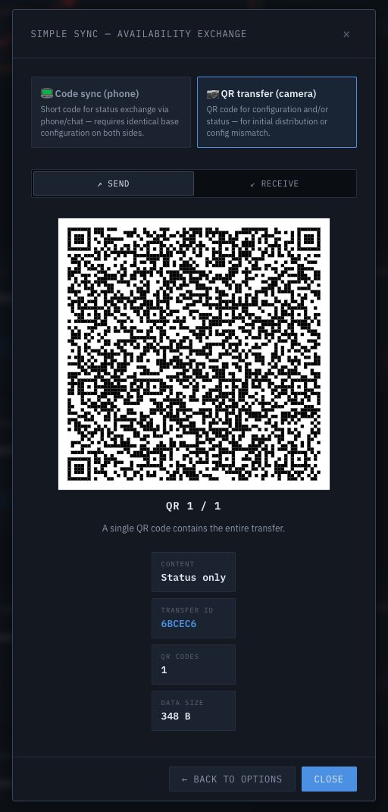
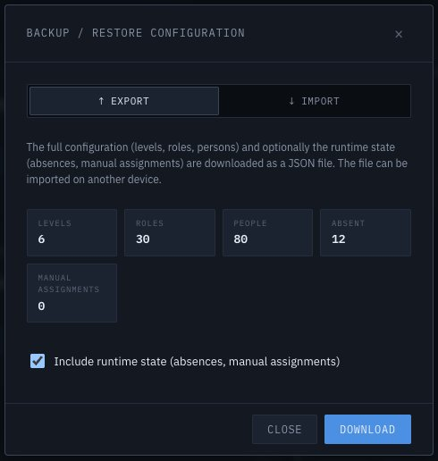
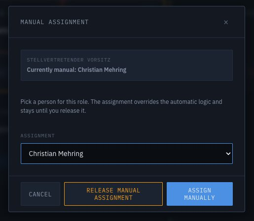

# CRAM — Crisis Role Availability Manager

A single-file web application for managing crisis committee roles and substitution chains. Built for IT security teams, business continuity managers, and anyone who needs to know at a glance who is currently available for a given role when a real incident hits.

Runs entirely in the browser. No server, no database, no external dependencies at runtime. Works offline after the first page load and can be installed as a progressive web app.

## What it does

- Define a **hierarchy of roles** organised in levels (for example: strategic committee → department leads → team leads → operational experts)
- Assign **multiple substitutes per role** in a clear order of succession
- Mark people as **unavailable** (holiday, sick, business trip, active elsewhere, other) and see the substitution chain take over automatically
- Visualise the flow with **cascade lines** that show where a substitute is actively covering for someone else on a different level
- **Override** an automatic assignment when a specific person must hold a role regardless of availability
- **Print paper versions** of the roster — in three different layouts, sized for A4, A3 or Letter, portrait or landscape
- **Transfer state between devices** via three independent channels, each for a different realistic situation:
  - A short code read over the phone for quick status updates
  - QR codes for full configuration transfer between nearby devices
  - JSON export/import for archival or e-mail distribution
- Keep a **30-day audit log** of every change that the committee can review after an incident

## Why it exists

Most crisis management tools are either heavyweight enterprise platforms (SAP, ServiceNow modules, dedicated BCM suites) or simple spreadsheets. The former take months to roll out and require IT ownership; the latter fall apart the moment two people edit them at the same time.

CRAM sits between those extremes. It is deliberately small, opinionated about the data model (hierarchical roles with ordered substitutes), and designed to work in the conditions where crisis tools tend to fail: on whatever device you happen to have with you, possibly offline, possibly under stress, possibly with network infrastructure that is itself part of the incident.

## Installation

Download the latest release from the [Releases page](https://github.com/Artaiios/CRAM/releases), open `crisis-role-manager.html` in any modern browser, and you're running.

For a better experience, install it as a progressive web app:
- **Chrome/Edge Desktop**: Click the install icon in the address bar
- **Chrome/Android**: Menu → "Add to Home screen"
- **Safari/iOS**: Share → "Add to Home Screen"

After installation, CRAM launches in its own window, without the browser chrome, and retains its state between sessions on the same device.

## Quick start

1. Open `crisis-role-manager.html`. The default configuration contains a small example committee.
2. Click the edit icon (✎) in the header to enter edit mode.
3. Click ⚙ **Settings** to set your organisation name and the title that should appear on printouts.
4. Add or modify roles, persons, and assignments. The organisation chart updates in real time.
5. Leave edit mode and click on any person in the chart to mark them as unavailable. Watch the substitution chain take effect.
6. Click 🖨 **Print** to generate a paper copy — choose the layout variant and paper size.
7. Use ⇄ **Sync** to transfer state to another instance of CRAM running on another device.

A comprehensive user and administrator handbook is available in [English](docs/handbook-en.md) and [German](docs/handbook-de.md).

## Demo configurations

Two large sample configurations are included for testing and demonstration. Each has 100 persons, 40 roles across 7 levels, and realistic crisis committee structures for a multinational enterprise:

- [`demo/cram-demo-enterprise-en.json`](demo/cram-demo-enterprise-en.json) — English role names and descriptions
- [`demo/cram-demo-enterprise-de.json`](demo/cram-demo-enterprise-de.json) — German role names and descriptions

Both contain the same 100 people with international names from all continents (Europe, the Americas, Africa, China, India, the rest of Asia, the Middle East, Oceania). Import via the Data (⇵) → Import panel.

## Core concepts

### Role hierarchy

Roles live inside **levels**. A level is a conceptual grouping — "Executive Board", "Department Heads", "Technical Experts". Each role has a name, a description, a **critical** flag, and a list of **assignments**.

### Assignments and the substitution chain

An assignment ties a person to a role at a given rank. Rank 0 is the primary; ranks 1, 2, 3... are substitutes in order of succession.

When the app resolves who is currently holding a role, it walks the chain:
- If the primary is available, the role is filled by the primary.
- If the primary is unavailable, the first available substitute takes over.
- If no one in the chain is available, the role is flagged as uncovered.

Each role card shows its complete chain at the bottom, with struck-through names indicating who is currently unavailable. When a substitute has actually taken over, the card is annotated with `Replacing: <original primary>`.

### Cascade visualisation

When one person covers for another on a different level, red dashed arrows are drawn between the affected role cards. This makes it immediately visible which chains are actively being exercised — useful when the committee is briefing and needs to know at a glance which positions are under substitution stress.

### Manual assignments

Sometimes the automatic rule isn't what you want. A manual assignment pins a specific person to a role regardless of availability — useful during an actual incident when the primary might be available but unfit for this particular task, or when a substitute has been specifically drafted in.

Manual assignments are marked with a 🔒 badge on the role card and persist until cleared. They are included in sync transfers.

### Status vs configuration

CRAM makes a clear distinction:

- **Configuration** is the static structure — who is in the directory, what roles exist, who substitutes whom. Changes infrequently, typically a few times a year.
- **Status** is the dynamic state — who is currently unavailable, which manual assignments are active. Changes constantly during an incident.

This separation matters because the two types of data have different transfer channels. A 30-second phone call can synchronise status across a dozen devices. Configuration needs a QR scan or a file exchange.

## Transfer channels

| Channel | What | Offline? | Typical use |
|---|---|---|---|
| Sync code | Status only | Yes | Phone call, chat, radio |
| QR transfer | Configuration, status, or both | Yes | Same room, no network |
| JSON export / import | Configuration, status, or both | Yes | E-mail, file share, archive |

### Sync code

A short alphanumeric code — typically 20 to 40 characters — that encodes the current availability of all persons plus any manual assignments. The sending instance generates the code; the receiving instance enters it. Both instances must share the same base configuration (verified by a 4-character fingerprint).

### QR transfer

For transferring full configurations, the sender generates one or several QR codes (compressed and encoded in fragments). The receiver activates their camera, holds it up to the sender's screen, and the fragments are collected and reassembled automatically.

Works offline, device to device. Requires a modern browser with the native barcode detection API (Chrome, Edge, Safari); Firefox users need to fall back to JSON file import.

### JSON export

A conventional JSON file with the full configuration and optionally the current runtime state. Useful for:
- Archiving the committee structure as of a specific date
- Sharing configuration with a colleague via e-mail
- Version-controlling the crisis committee definition in your documentation system
- Seeding a fresh CRAM instance on a new device

## Print / PDF

Three variants, each sensibly sized for the chosen paper:

- **Overview** — a one-page wall chart. Roles grouped by level, each showing its primary occupant and phone number in large type. Critical roles are marked in red.
- **Role detail** — multi-page structured listing. One section per level; each role shows the current occupant, the complete substitution chain with phone numbers, and any manual assignment.
- **People list** — alphabetical phone directory. Absent people are called out in a separate section.

All three variants support A4, A3, and Letter in both portrait and landscape. The layout scales to fill the selected page.

## Languages

The user interface is available in:
- German (Deutsch)
- English
- Spanish (Español)
- French (Français)
- Chinese (中文)

The language switcher is in the header. The selection persists between sessions.

## Editing the committee

Edit mode is activated with the ✎ icon in the header. While in edit mode you can add or rearrange levels, roles, and persons, and manage the substitution chain for each role.

The Settings dialog exposes the organisation name and the print title — both are empty by default and are shown on every printed page if filled in.

## Tracking absence

Clicking a person in the main view (when not in edit mode) opens a dialog to mark them unavailable. A reason category and an optional note can be recorded. Once marked, the person's availability is reflected across all roles they are assigned to, and the substitution chain takes over automatically.

The sidebar has three tabs:

- **Roster** — shows who is currently absent at the top, followed by the active occupants with their contact details grouped by role.
- **People** — alphabetical list of all persons with their availability status and quick filter.
- **Log** — the 30-day audit trail.

## Privacy and data handling

Everything stays in the browser. There is no backend, no analytics, no telemetry. The three storage keys (`cram.config`, `cram.runtime`, `cram.audit`) live in the browser's localStorage and never leave the device unless *you* export them.

This does mean there is no cloud sync, no cross-device login, no backup unless you make one yourself. The transfer channels above are the only way data moves between instances.

## Browser compatibility

| Feature | Chrome/Edge | Safari | Firefox |
|---|---|---|---|
| Core functionality | ✓ | ✓ | ✓ |
| QR code generation | ✓ | ✓ | ✓ |
| QR code scanning | ✓ | ✓ | — (missing BarcodeDetector API) |
| PWA installation | ✓ | ✓ | partial |
| Camera over `file://` | ✓ | ✓ | ✓ |
| Camera on mobile over `file://` | — | — | — (needs HTTPS) |

Firefox users can still use every feature except the QR scanner. For mobile camera access, the tool needs to be served over HTTPS, localhost, or loaded from `file://` with appropriate permissions.

## Known limitations

- QR scanning is not available on Firefox. We chose not to ship a 130 KB polyfill for a minority-browser edge case. Firefox users on desktop can transfer configurations via JSON export instead.
- The tool is deliberately single-device and offline. There is no central server, no account system, no cross-device sync. Configuration changes must be propagated explicitly through one of the three transfer channels.
- localStorage is tied to the browser origin. Opening the same HTML file from two different paths counts as two separate installations with independent state.
- At very large committee sizes (100+ persons, 40+ roles), the overview print variant may overflow A4 landscape. A3 handles this comfortably.

## Licence

Apache License 2.0. See [LICENSE](LICENSE).

## Acknowledgements

CRAM embeds two third-party libraries, both inlined for the single-file architecture:

- **fflate** by Arjun Barrett — MIT License. Compression for QR transfer payloads.
- **qrcode-generator** by Kazuhiko Arase — MIT License. QR matrix generation.

## Contributing

Bug reports, feature requests, and pull requests are welcome. See [CONTRIBUTING.md](CONTRIBUTING.md) for how to file an issue or submit a change.

## Disclaimer

CRAM is a tool, not a plan. It assists with tracking and communicating role assignments; it does not substitute for a tested crisis management process, trained personnel, or the judgment of whoever is responsible for committee leadership during an actual incident. Test it under realistic conditions before relying on it.
