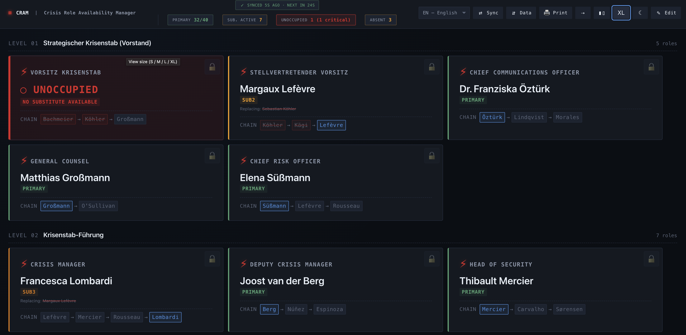
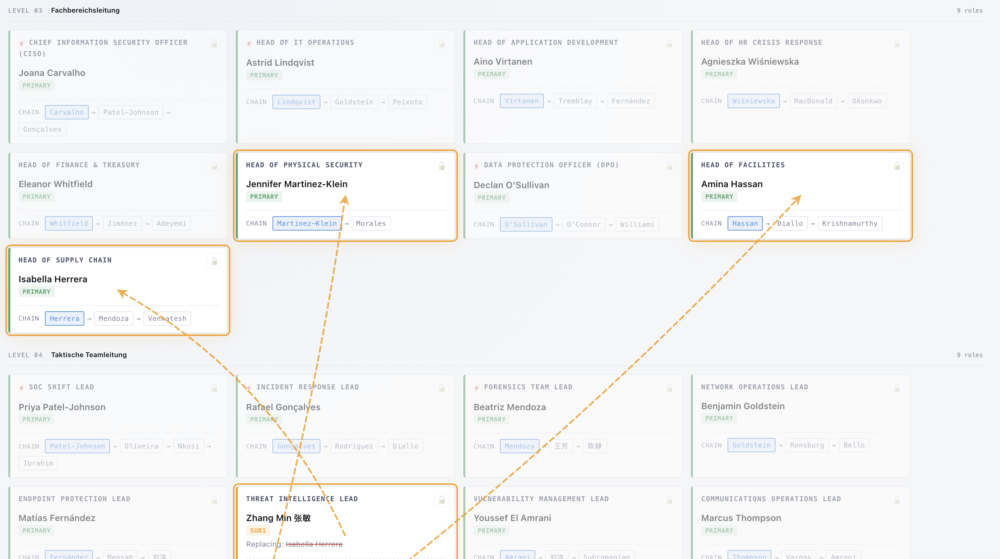
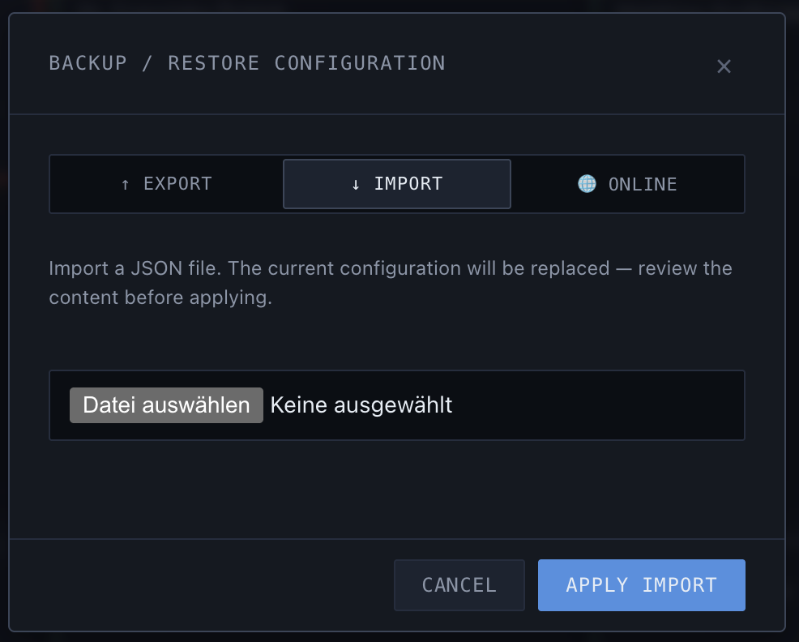
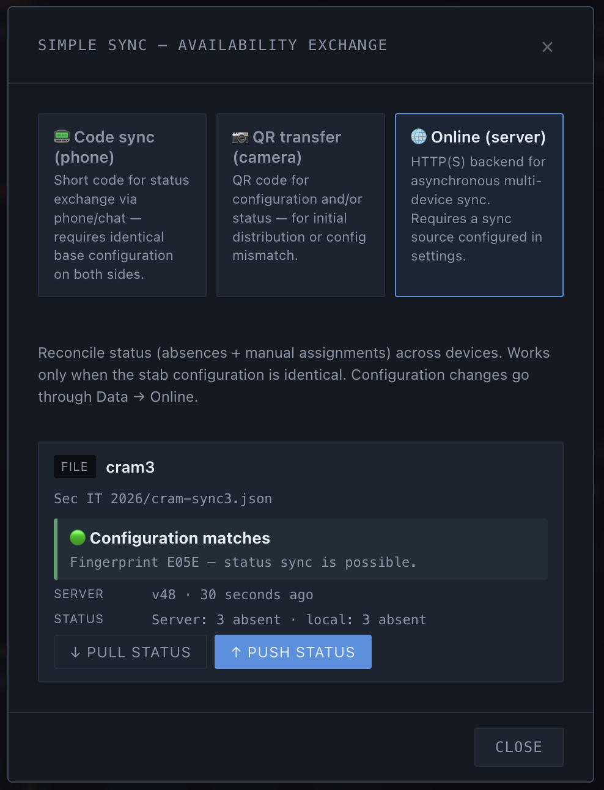
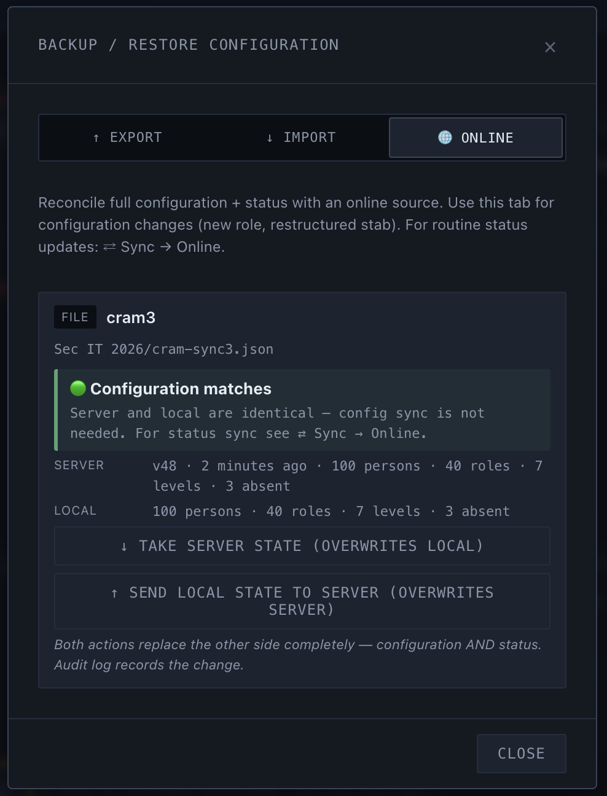
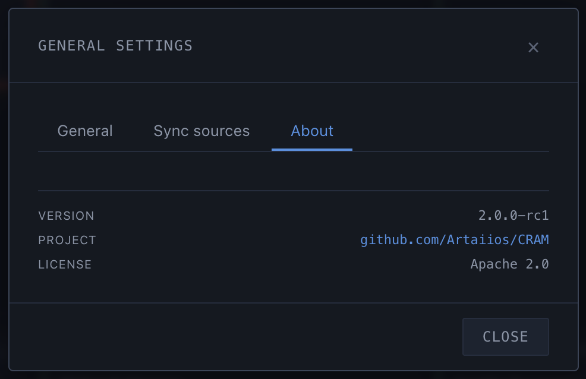

# CRAM — Handbook

This handbook describes the operation of CRAM — the Crisis Role Availability Manager. It is split into two parts. The **user section** is for any member of a crisis committee who works with the tool during an incident. The **administration section** is for those who maintain the configuration, distribute new versions, and are responsible for operations.

> Screenshots show the included Enterprise demo configuration (`cram-demo-enterprise-en.json`) with placeholder names. Real organisational data is never shown.

---

# Part 1: User Section

## Opening the tool for the first time

CRAM is a single HTML file. A double-click is enough — the file opens in the default browser. No server is required, no installation, no internet connection.

On first start, CRAM is **empty** — no people, no levels, no roles, no pools. This is deliberate (since V2.2): the tool must not be confused with sample personal data that could accidentally end up powering a real committee. The empty-state on the chart page points to three ways forward:

1. **Enter edit mode** (✎ in the header) and build your own structure.
2. **Import a demo configuration** — `cram-demo-enterprise-en.json` or the German variant. Both live in the repository under `demo/` and are attached as assets to every GitHub release (see Quick start below).
3. **Import an existing export file** from another instance via **Data → Import**.

If you opened CRAM just to explore it, load one of the demo configurations — it carries 70 people, 4 levels, and 5 pools and shows a visible cascade immediately after import (one person is deliberately marked absent).

Anyone using CRAM regularly should install it as a Progressive Web App (PWA):

- **Chrome/Edge desktop**: Install icon on the right side of the address bar
- **Chrome Android**: Menu → "Add to Home screen"
- **Safari iOS**: Share menu → "Add to Home Screen"

After installation, CRAM launches in its own window without browser chrome. State persists between sessions.

## The interface at a glance

After starting, you see three main areas:

- **Header**: Version display, statistic pills (Primary, Substitute active, Unoccupied, Absent), language selector, action buttons (Sync, Data, Print, Edit-mode toggle, theme switcher)
- **Main area**: Organisation chart with levels and roles. Each role is displayed as a card.
- **Right sidebar**: Three tabs — **Roster** (current occupancy and absence list), **People** (all persons by name), **Log** (audit trail)

## Understanding role cards

Each role card shows the following information:

- **Role name** at the top (e.g. "Crisis Manager")
- A **lightning symbol** if the role is marked as critical
- The **current occupant** with their rank — `PRIMARY` for the planned person, `SUB1`/`SUB2` when a substitute has taken over
- A **replacing note** if someone other than the primary is covering — the person being replaced is shown with strikethrough
- At the bottom, the complete **substitution chain** (`CHAIN`): Primary → Sub1 → Sub2 → … with struck-through entries for people who are currently unavailable

A **lock symbol** in the top right indicates that this role has been manually assigned and does not follow the automatic logic.

## Marking a person unavailable

In normal operation — that is, outside edit mode — a single click on a person's name within a role card opens the unavailability dialog.

Pick a **reason**:

- **On leave**
- **Sick**
- **Business trip**
- **Active in other role** — useful when the person is tied up in a different context
- **Other**

An optional **note** can be added — for instance an expected return time or a handover instruction.

After confirmation, the person counts as unavailable. All roles in which they are assigned are automatically re-resolved — if they were primary, the first available substitute takes over. The chain is visibly updated.

## Understanding the substitution cascade

As the number of absences grows, cascades form: A role loses its primary, the substitute steps in — but is itself primary in another role, triggering a further shift there.

CRAM visualises such cascades with animated dashed arrows between the affected role cards. This makes it immediately visible which substitution chains are currently under stress — an important piece of information for the committee lead when assessing how robust the current lineup is.

If no person is available anywhere in a chain, the role is flagged as **Unoccupied**. The corresponding pill in the header shows the count of unoccupied roles; it turns red when a critical role is affected.

## Legend: what the colours and symbols mean

CRAM uses colour and animation to signal the current state of every role and cascade. The full legend:

### Role card left border — the role's current state

| Colour | State | Meaning |
|---|---|---|
| Green | Primary | The planned primary occupant is active |
| Yellow | Substitute (Sub1) | The first substitute has taken over |
| Dark orange | Substitute (Sub2 or deeper) | A second-tier or later substitute is active |
| Red | Unoccupied | Nobody in the chain is available |
| Red + pulsing | Unoccupied + critical | Critical role is unoccupied — attention required |

### Role card border and surroundings — special conditions

| Signal | Meaning |
|---|---|
| Purple solid border + 🔒 badge | Role currently has a manual assignment in effect |
| Purple dashed border + struck-through name | Role was manually assigned to someone who has since become unavailable |
| Yellow outline around card | Card is part of a non-critical cascade |
| Yellow outline + glow | Cascade target (non-critical) — this is where the substitute is actively standing in |
| Red outline around card | Card is part of a cascade into a critical role |
| Red outline + glow | Cascade target on a critical role |
| Dimmed (50% opacity) | Cascade view is active and this card is not involved in any cascade |

### Cascade arrows (only visible while cascade view is enabled)

| Colour | Animation | Meaning |
|---|---|---|
| Yellow dashed | Slow flow | Substitution into a non-critical role |
| Red dashed, thicker | Faster pulse with red glow | Substitution into a **critical** role — watch this carefully |

The arrow colour is determined by the **target role** (where the person is standing in), not by the person's home role. A green substitute stepping into a red-critical role produces a red arrow; a primary from a critical role covering a non-critical role produces a yellow arrow.

### Critical roles in print (since V2.2)

On screen, "critical" is marked by the lightning symbol and the red colour coding. Neither carries reliably to print — red bars vanish on black-and-white printers. Since V2.2 every critical role card in print also carries a **‼ symbol in the top right**. Dual-coded (colour + glyph), fixed at 10pt, does not scale with Auto-Fit reduction — the symbol stays readable even at small scaling factors.

### Header status pills — system-wide state

| Colour | Meaning |
|---|---|
| Grey (neutral) | Informational count, no action required |
| Yellow outline | Active but non-critical condition — substitutes have stepped in |
| Red + pulsing | At least one critical role is unoccupied |

### Sidebar accents

| Element | Colour | Meaning |
|---|---|---|
| Roster entry, left border | Green | Role held by primary |
| Roster entry, left border | Yellow | Role held by substitute |
| Roster entry, left border | Dark orange | Role held by deeper substitute |
| Roster entry, left border | Red | Role unoccupied |
| People list entry, left border | Yellow | Person is currently unavailable |

## Manual assignment

Sometimes a specific person should hold a role — regardless of the automatic substitution logic. Examples: The planned primary is technically available but tied up with another topic; or the committee lead has decided operationally that a specific substitute should step in.

For these cases there is **manual assignment**. In edit mode, or via the pin button on a role card, a dialog opens in which a person can be picked from the overall list. The assignment remains until explicitly released ("Release manual assignment").

Manually assigned roles are marked with a 🔒 symbol on the role card and flagged as such in the Roster tab. They are included in sync transfers (both code sync and QR transfer).

## Team pools (since V2.1)

Below the classic three-tier hierarchy (crisis committee → management → topic lead) there is a fourth tier: **team pools**. A pool is a group of employees attached to a lead role — typical use cases are on-call rotations, specialist teams (forensics, threat intel, legal) or extended response groups that report into a lead but are not formal substitutes in the chain.

### What a pool is — and what it is not

A pool consists of:

- **Name** (required, max 200 characters) — e.g. "SOC On-Call Shift A"
- **Lead role** (required) — the role this pool is attached to
- **Members** — list of people from the People directory
- **Notes** (optional, max 2000 characters) — free text for handover hints, out-of-band contact info
- **Optional secondary leads** — pools can appear as a cross-reference on a second role without being duplicated there

A pool **does not replace a substitution chain**. People who must be formal substitutes belong in the role's assignment list. Pool membership can exist in parallel — a `[SUB]` badge on the pool pill makes the overlap visible.

### Creating a pool (V2.1.1+)

Pools are created in the **edit mode of the chart**, directly under the relevant column:

1. Click ✎ in the header to enter edit mode
2. In the column with the lead role, click **"+ Pool"**
3. In the modal: name, lead role (pre-filled), members via pick list, optional notes and secondary leads
4. Save — the pool appears directly below the lead card

Edit and delete are inline via `✎` and `×` on the pool header — same pattern as role editing.

**Alternative path for power users:** Settings → "Pools" tab shows all pools as a list with bulk actions. This is secondary to the chart-inline workflow.

### How pools render in the chart

- **Desktop (≥ 1024 px)**: pool sits directly below the lead card in the same column. A subtle top connector links them visually; a "POOL OF:" label is unnecessary — spatial proximity carries the meaning.
- **Tablet (768–1023 px) and mobile (< 768 px)**: pool sits at the end of the level, horizontally. On mobile it is collapsed by default and expands on click.
- **Pill layout**: max four members per row, sorted by availability (available first), then alphabetically.
- **Status icons** are shape-coded, not colour-only — state is recognisable without colour perception (accessibility).

### Pool pills are clickable (since V2.2)

In normal mode (outside edit mode), clicking a pool pill opens the person detail in the side panel — same path as clicking a name in a role card. Keyboard works too (Tab to focus, Enter or Space to trigger). In edit mode the click is disabled so that editing on the pool header (`✎`/`×`) is not accidentally hidden behind a person modal.

### Availability at the pool level

Each pool member carries their normal availability state from the People area. That lets you see at a glance how many of the pool are ready to engage. There is no separate "pool readiness" model — the pool is a view onto the People data, not a parallel system.

### Pool members as substitutes

One person can simultaneously be:

1. **Primary** or **substitute** in a role (via the assignment list)
2. **Member** of one or several pools

This dual status is explicitly allowed and is the norm in crisis-committee practice (the on-call lead is also the topic-lead's sub2). A **`[SUB]` badge** on the pool pill surfaces this — anyone who is both in a pool and in a substitution chain is flagged.

### Orphaned pools

If the lead role of a pool is deleted, **the pool is not deleted with it**. Instead it moves to a dedicated section at the end of the chart ("Unassigned", with a warn border). The institutional knowledge (who is in which squad) is preserved even when the organisational anchor is gone. The pool can be re-attached to a new lead role or explicitly deleted from there.

### Sync note for pools

Pool changes are part of the **configuration**, not the status. Status-mode sync (the short sync code, automatic status push) **does not carry pool changes** — the configuration fingerprint deliberately ignores them.

Anyone who has added, edited, or deleted a pool must distribute that change via the **data mode**: JSON export, QR transfer with scope "Configuration + Status", or Online-Sync in data mode. See the "Sync vs. Data — what to use when (V1.3)" section.

## Keywords (since V2.1)

People carry an optional list of **free-form tags** — keywords. They capture things that don't model cleanly as roles: specialisations, certifications, languages, equipment affinities.

**Examples:** "SOC analyst tier 2", "macOS forensics", "cloud reverse engineering", "fluent French", "TPM/HSM experience".

### Maintaining keywords

In edit mode or directly from the People list, open the **person-edit modal**. In the "Keywords" field:

1. Type a tag
2. Enter or comma commits it as a chip
3. Or pick from the autocomplete dropdown (shows all keywords already used across the org — encourages consistent terminology)
4. The `×` on a chip removes a keyword

### Limits

- **Max 64 characters per keyword** — labels, not sentences
- **Max 32 keywords per person** — past that, the organisation is probably better modelled with roles than tags
- **Keywords are not a skill-level system** — no tier 1/2/3, no certificate expiry. Both are on the post-V2.1 roadmap

### Sync behaviour for keywords

Like pools, keywords are part of the **configuration**. Status sync does not transfer them — data-mode sync is needed.

## Search (since V2.1)

With pools and keywords comes the near-inevitable use case: "Who can do cloud forensics right now?" That's what the new **Search tab** in the sidebar is for.

### Where the tab lives

- **Desktop**: sidebar tab between "People" and "Log" (fourth tab)
- **Mobile**: fifth button in the bottom nav bar (between "People" and "Log")

### What search does

The search field matches across four fields simultaneously:

- **Name** (first and last)
- **Keywords** (all tags assigned to the person)
- **Phone number**
- **E-mail**

Filters on top:

- **Availability**: All / Available only / Absent only
- **Keyword cloud**: shows every keyword used across the org as a clickable chip. Multi-select is **AND-combined** — picking "macOS forensics" AND "available" returns only people who satisfy both.

### Hit representation

Each hit is a **person card** with:

- Status icon (available / absent, same shape vocabulary as the pool pills)
- Name + contact info (phone, e-mail)
- **Role memberships**: every role where the person is primary or substitute, with rank badge
- **Pool memberships**: every pool the person belongs to
- **Keyword chips**: all tags

Click on a card opens the person-edit modal — you can correct a keyword or update a phone number straight from the search result.

### Typical query patterns

- "Who can do cloud forensics in the next hour?" → filter "Available" + keyword chip "Cloud forensics"
- "Who in the org speaks fluent French?" → search field "French" or the corresponding keyword-cloud chip
- "Am I currently the only available macOS forensicist?" → filter "Available" + keyword "macOS forensics"

Search is a read-only view — it does not change state. Edits happen in the person-edit modal after clicking a card.

## Transferring data to another device

CRAM offers three ways to transfer data between devices. Which one to use depends on the situation.

### Sync code (telephone)

Designed for quick **status updates over the phone**. A sync code is a short alphanumeric string (typically 20–40 characters) that encodes the current absence state and manual assignments. It is formatted in groups of four for easy telephone dictation.

Prerequisite: Sender and receiver share the same base configuration. The first four characters are a fingerprint of the configuration — if they match on both sides, the schema is compatible and the code is accepted.

**Operation:**

1. Open sync modal (⇄ button in header)
2. Select channel "📟 Code sync (phone)" — this is the default
3. The "↗ Send" tab is pre-selected — the code appears immediately
4. Read the code over the phone or paste it into chat
5. Receiver opens their sync modal, switches to "↙ Receive", enters the code and confirms

Entered codes are validated live: A mistyped character leads to a fingerprint mismatch and is detected before anything is applied.

**Limits:** The sync code transfers **only status**, no configuration. For initial setup or changes to roles/people, use the other channels.

### QR transfer (camera)

For the **initial distribution of a configuration** or when configurations differ between devices. Data appears as a QR code on the sender's device and is read by the receiver with the camera.

**Sender operation:**

1. Open sync modal, select channel "📷 QR transfer (camera)"
2. "↗ Send" tab, then pick scope:
   - **Configuration only** — roles, levels, people (no status)
   - **Status only** — absences and manual assignments
   - **Configuration + status** — everything
3. Click "Generate QR code(s)"
4. Small configurations show a single QR code; larger ones produce a series of fragments
5. With multiple fragments, activate "▶ Auto-advance" — every 2.5 seconds the next QR is shown automatically

**Receiver operation:**

1. Open sync modal, channel "📷 QR transfer (camera)", tab "↙ Receive"
2. Click "Start camera" — grant permission
3. Point camera at the sender's screen. Fragments are detected automatically; the progress dots show which ones have arrived (green) and which are still missing (grey).
4. Once all fragments are in, the preview appears — with statistics on configuration and status.
5. Click "Apply" — the data is applied; an entry in the audit log documents the import.

**Prerequisites:**
- Modern browser with `BarcodeDetector` API: Chrome, Edge, Safari. Firefox does not currently have this API.
- For camera access on mobile: HTTPS, localhost, or `file://` — HTTP does not work.

### JSON export/import

For **archival, email distribution, or version control**. The configuration (and optionally the status) is downloaded as a JSON file and can be imported on another device.

**Export:**

1. Open data modal (⇵ button)
2. Tab "↑ Export"
3. If needed, tick "Include runtime state" to include status as well
4. Click "Download" — a file `cram-export-YYYY-MM-DD-HH-MM-SS.json` is saved

**Import:**

1. Open data modal, tab "↓ Import"
2. Pick file — contents are validated
3. Review preview (number of levels, roles, people)
4. Click "Import" — existing data is overwritten

### Online sync (since V1.2)

For **regular status reconciliation across a distributed team** over the network. Unlike Code / QR / file, online sync does **not** require live contact between sender and receiver — everyone pushes their state to a shared endpoint and pulls the latest combined state from there.

In V1.2/V1.3 both actions are **manual** (two buttons in the Sync modal). Since V2.0 there is an additional **automatic mode per source** — opt-in, default OFF (see "Auto-Sync (since V2.0)" further down).

**Two backend types are supported:**

- **HTTP server** — a self-hosted endpoint (nginx with `dav_methods`, Caddy + the WebDAV plugin, SharePoint WebDAV, MinIO, Synology NAS). The server hosts a single file `state.json`. Setup guidance in [`docs/server-setup.md`](server-setup.md).
- **Local directory** — typically a folder that OneDrive / Dropbox / Google Drive synchronises between devices. CRAM writes the file into the folder; the vendor's desktop sync client handles distribution. No server to run.

**Add a sync source:**

There is no dedicated header button for the Settings dialog. The path is always: enter edit mode, then click ⚙ **Settings** in the edit banner. Notice banners (e.g. after an update) also expose a direct "Open settings" button.

1. Enter edit mode (✎ in the header)
2. Click ⚙ **Settings** in the edit banner
3. Switch to the **Sync sources** tab
4. Pick:
   - **+ New HTTP source** — label (free-form, e.g. "Primary internal server"), endpoint URL, authentication (None / Basic / Bearer)
   - **+ Local directory** — label, then "Choose directory…"; the browser asks for a folder; optionally adjust the filename (default `cram-sync.json`)
5. **Encryption** is enabled by default (end-to-end, AES-256-GCM with PBKDF2 from your passphrase). Enter a passphrase and confirm it. **Save it in a password manager** — CRAM only keeps it in memory and discards it whenever the tab closes.
6. Save.

Once the source is configured, a small **sync indicator** appears left of the status pills in the header showing the current state: ✓ Synced, ↑ Changes (unpushed local edits), ↻ Syncing, ✗ Error.

**Manual synchronisation:**

1. Open ⇄ **Sync** in the header
2. Pick the **🌐 Online (server)** channel
3. Each configured source shows two buttons:
   - **↓ Pull from server** — fetches the server state and overwrites your local one
   - **↑ Push to server** — sends your local state and overwrites the server state
4. For encrypted sources, CRAM prompts for the passphrase when needed (for example after a tab restart). The passphrase is never persisted.

**Share a source with the team — sync bundle:**

To let colleagues sync against the same source, you export a **sync bundle**: a JSON object with everything needed to bootstrap (URL or filename, auth data, salt, passphrase).

1. In **Settings → Sync sources**, click "Share" on the relevant source
2. The modal shows the bundle JSON with a clear warning: **the bundle is confidential** — it contains the passphrase and credentials in plaintext
3. Distribute over a secure channel: Signal/Threema, a password-manager entry, hand-delivery. **Never send via plain email or chat.**
4. The colleague opens CRAM, Settings → Sync sources → **⇩ Import bundle**, pastes the JSON or loads it from the file
5. CRAM shows a preview with source type, URL/filename, encryption status, and a fingerprint comparison. If the fingerprints don't match, you'd sync against different team configurations — CRAM warns explicitly.
6. "Apply" — for local-directory bundles, CRAM now asks for the local folder (the recipient picks their own path).

**Things that can go wrong with online sync:**

- **Server unreachable** — VPN off, wrong URL: the indicator goes red ✗ with the error text; local data stays as-is
- **Wrong passphrase** — pull decryption fails: "Decryption failed — wrong passphrase?". You can re-enter via the prompt
- **Accidentally sharing an unencrypted bundle** — the form requires opting OUT of encryption explicitly; default is always Encryption=ON
- **Wrong fingerprint on import** — you'll see a warning and can still proceed if you're sure (e.g. a brand-new team)

**Browser note:** Firefox does not support the "Local directory" type because Mozilla rejects the File System Access API. HTTP sources work in every browser. When Firefox is detected, CRAM shows a hint banner in the Sync sources tab.

### Sync vs. Data — what to use when (V1.3)

Since V1.3 the online sync is split into two cleanly separated tools:

- **⇄ Sync → Online**: status only (absences + manual assignments) — the data that changes many times per hour during a real incident. Works **only** when the committee configuration is identical between server and local. On mismatch the sync action is disabled and points you at Data.
- **⇵ Data → Online**: full configuration + status — the structural changes that rarely happen (new role, restructured committee, new person). Works always, with explicit confirmation dialog.

The split is a safety property: status sync cannot accidentally overwrite the committee structure.

**Common workflows:**

- *Incident routine (change absences):* ⇄ Sync → Online → "Pull status" or "Push status". Fast, two clicks.
- *Structural committee change:* Edit mode → adjust the configuration → ⇵ Data → Online → "Send local state to server". Server is overwritten with a confirmation.
- *First-time bundle import:* After import CRAM asks: "Server already has a state — take it now?" → click yes, done.

**Awareness indicator (header):** when a server probe (Sync or Data modal opened) finds the configurations differ, the indicator switches to red "⚠ Config drift" — clickable, jumps directly to Data → Online.

### Auto-Sync (since V2.0)

V2.0 adds a **background poller per source** so that status updates propagate between devices without a manual click. The mode is enabled **per source individually**. After updating from V1.x the default is **OFF** — the manual buttons keep working as before.

After updating from V1.3, a one-time migration banner appears in the Sync sources tab the first time the tab opens. It explains the new mode field and the default off-state. The notice only shows up in the Settings dialog on the **Sync sources** tab — not in the header sync dialog (⇄) and not in the header data dialog. Looking for it there is a dead end.

**Enable Auto-Sync:**

1. Edit mode → ⚙ Settings → **Sync sources** tab
2. Each source has an **Auto-Sync accordion** with:
   - **Mode** (toggle):
     - `off` — no auto-sync (default)
     - `pull` — poll the server periodically (passive consumer)
     - `push` — push immediately on local changes (active publisher, no polling)
     - `bidirectional` — both
   - **Polling interval:** slider 30 / 60 / 90 / 120 / 180 / 300 seconds
3. Once Auto-Sync is active, the header indicator shows a **live countdown** to the next action: "Synced 12s ago · next in 18s".

**Behaviour in special states:**

- **Tab in the background:** polling interval is stretched ×4. On returning to the tab, CRAM pulls immediately, regardless of the polling cycle.
- **Browser offline (`navigator.onLine = false`):** polling stops completely, no retry storm. Sidebar shows "Offline since HH:MM". When the browser comes back online, an immediate resume tick fires.
- **Auth loss (401/403):** Auto-Mode is switched OFF automatically. A persistent badge in the Sync tab and the Settings accordion shows "Authentication expired — please sign in again". On the next tab focus, a one-shot catch-up toast displays the time of the auth loss.
- **Passphrase missing** (e.g. after a tab restart on an encrypted source): Auto-Sync pauses, accordion shows a "Passphrase required" badge. User action: re-enter the passphrase.
- **File access lost** (S5, local directory — after reboot or third-party process): hard-pause, no retries. Sidebar shows "Confirm file access again" with a "Grant access" button.
- **Push conflict** (someone else wrote in between, ETag mismatch → HTTP 412): CRAM automatically pulls, merges locally, pushes again. If that fails after 3 attempts: toast "Sync conflict — please review".
- **Configuration drift** (server has a different committee structure): treated as its own error class — auto-push pauses for this source, the indicator turns red "⚠ Config drift", a modal lists the affected sources with the options "Take the server's configuration" (triggers a full pull via Data → Online) or "Later".

**Crash recovery (crash mid-push):**

If the tab is closed during a push, CRAM detects a sentinel on the next start and shows a modal: "The last sync operation was interrupted — please review manually". Two options: "Push again (with conflict check)" or "Discard". Auto-Sync for that source is paused until the user decides.

**Toast notifications:**

- *State updated by [user] at [time]* — when an incoming pull changed visible data
- *Your edit was replaced by a newer version — see log* — when a local edit was lost to a sync conflict (subtle red, 8 s)
- *Sync conflict resolved* — after a successful pull-merge-push retry

**What Auto-Sync NEVER does:**

- Auto-Sync touches **status only** (absences + manual assignments). Structural configuration changes (new role, person added, committee restructured) **always** go through Data → Online with an explicit confirmation dialog. Automatic configuration takeover without a user click is architecturally impossible.
- Auto-Sync never triggers a modal dialog for incoming updates — only toasts. The UX rationale: during an incident no dialog should compete for attention.

**Note on S5 (local directory):** The File System Access API has no ETag/If-Match equivalent. With two parallel writes to an S5 source, one version can be lost without CRAM detecting the conflict. This is surfaced in the Settings accordion of S5 sources with an explicit hint. Auto-Pull on S5 works; Auto-Push on S5 is disabled in V2.0-rc1.

**iPhone note (PWA standalone mode):** Apple clears Web App data after roughly 7 days of inactivity. Anyone installing CRAM as a PWA on iOS and only opening it sporadically risks losing local sources, the audit log, and the configuration. Mitigation: export JSON regularly, **or** make sure an HTTP sync source is configured — after data loss a single Pull restores the state. The iPhone smoke test has not yet been verified against a physical device in V2.0-rc1 (see CHANGELOG "Deferred").

## Printing

CRAM has four print templates for paper copies. All four work with A4, A3 or Letter in portrait or landscape.

**Overview – compact** (variant 1): Wall chart with all roles grouped by level, each showing its primary occupant and phone number in large type. Targets one page; since V2.2 with an honest caveat — on larger committees it can become two (see Auto-Fit below). Critical roles carry a red bar plus a ‼ symbol in the top right — both readable in black-and-white print too.

**Role detail** (variant 2): Multi-page structured listing. One section per level; each role shows the current occupant, the complete substitution chain with phone numbers, any manual assignment, pool members, and keyword tags.

**People list** (variant 3): Alphabetical phone directory with current status. Absent people are called out in a separate section, keywords listed as a compact chip row per person.

**Pools** (variant 4, new in V2.2): One section per team pool, sorted alphabetically by pool name. Per pool: lead role (including secondary leads if any), every member with phone number, keyword tags, and current availability state. Multi-page — no single-page constraint.

**Operation:**

1. Print button (🖨) in header
2. Pick template (Overview, Role detail, People list, Pools)
3. Pick paper size and orientation
4. "Open print dialog" — in the browser's print dialog, choose "Save as PDF" as destination if needed

The organisation and print titles set in Settings appear in the header of every printout. If empty, a language-dependent default title is used.

### Auto-Fit for the overview print (V2.2)

Since V2.2 the overview variant scales the wall chart to one page when it can. Scaling starts at a format-base factor (A4=1.00, A3=1.15, Letter=1.03) and steps down. The floor is 0.70 — below that CRAM stops scaling so the print stays readable.

What that means in practice:

- **A3 portrait or landscape** reliably carries typical committees up to about 40 roles on a single page.
- **A4** handles small committees (up to roughly 20 roles) on one page. Larger committees honestly become two pages — the variant hint in the print modal announces this ("maximally dense, one page when possible, otherwise two").
- **Floor warning:** if even at scale 0.70 the layout overflows, a toast after the print dialog suggests A3 or the Role detail variant. The floor hit is also logged in the audit log.

The layout uses CSS Grid instead of a multi-column flow. Consequence: cards no longer stretch vertically, long phone numbers are truncated with an ellipsis in a single line instead of wrapping, and empty levels are skipped instead of rendering a hollow header.

### Pool print variant – when to use

The pool variant (V2.2) complements the phone directory with a skill-oriented view. Typical uses:

- **On-call room notice board next to the phone:** who is in the SOC pool, who in Forensics, who in Legal Response — at a glance.
- **Shift handover:** print the pool state at end of shift, hand it over at the next briefing.
- **Tabletop exercise:** print the pool list before the exercise, lay it out in the exercise room.

Unlike the overview, there is no single-page ambition here — pools grow across pages, and the alphabetical sort keeps every pool findable.

## Switching language

The language selector is in the header. Currently available: German, English, Spanish, French, Chinese. The selection persists between sessions.

## Display

The ☀/☾ symbol in the header toggles between light and dark theme.

The **S/M/L/XL** size steps adjust the display density of the organisation chart to screen size. On mobile devices there is a dedicated layout variant with bottom navigation.

## Reading the audit log

The Log tab shows all changes over the past 30 days:

- Configuration edits (which role, what changed)
- Absence notifications (who, with which reason, when)
- Manual assignments (which person, which role, set/released)
- Sync events (incoming and outgoing codes, imports)

Entries older than 30 days are removed automatically. The log is kept purely locally — there is no cross-device synchronisation, each client has its own log.

---

# Part 2: Administration Section

## Role and responsibility

The tool administrator of a crisis committee is typically the person who:

- agrees the role hierarchy with the committee leadership
- maintains people and their substitution chains
- distributes the configuration to all committee members
- rolls out application updates and coordinates field tests
- serves as first point of contact for technical issues

Typically this is someone from IT Security, Business Continuity Management, or the crisis management office. The role is not technically demanding — the tool is deliberately kept simple — but requires an overview of the committee and its processes.

## Building the initial configuration

The Settings dialog (⚙ in edit mode) is the entry point for the organisation name, print title, language, density, and the Sync sources tab.

The About tab in Settings carries the version, the build hash, and the list of embedded libraries.

Starting from scratch, there are two options:

**Option A — Build from the empty tool:** Since V2.2 CRAM starts empty. Enter edit mode and add levels, people, roles step by step. Good for small committees (up to ~15 roles) or when the structure is strictly prescribed.

**Option B — From a demo file:** Under `demo/` the repository ships two enterprise demo configurations with 70 people, 4 levels, 28 roles, and 5 skill-based pools (SOC analysts, Forensics, Crisis Communications, IT Recovery, Legal Response). Import and then adjust — faster for larger committees, because the basic structure and the pool model are already in place. Both demo files are also attached as assets to every GitHub release.

**Recommendation:** First create all **levels**, then enter the **people**, finally the **roles with substitution chains**. In this order because:

- Without levels you cannot create roles
- Without people you cannot make assignments
- Roles and assignments are the most effortful part — avoids context switching

## Maintaining people

In edit mode the People tab becomes an editor. A person has:

- **Name** (mandatory)
- **Phone number** (optional but strongly recommended — this is the central contact information during an incident)
- **Email** (optional)
- **Keywords** (optional, since V2.1) — free-form tags like "SOC tier 2", "macOS forensics". Power the Search tab. Details in the "Keywords" chapter.

Recommendations:

- **Unambiguous names**: For common names like "Michael Weber", add a title or middle name to prevent confusion in the cascade view.
- **Phone numbers in international format**: `+49 170 1234567` rather than `0170 1234567`. Makes callbacks possible from any device.
- **Update at least every six months**: People change jobs, phone numbers change. A calendar reminder helps.

## Defining roles

Edit mode is activated with the ✎ icon in the header. While in edit mode, role cards expose pencil and pin handles for direct manipulation, and the sidebar tabs become editors for people and levels.

A role consists of:

- **Name** (mandatory) — should describe the function, not the current person
- **Description** (optional, but strongly recommended) — a sentence that makes the responsibilities clear. Under stress, nobody pulls up external documents.
- **Critical flag** — marks the role as critical; it is highlighted in print and statistics
- **Assignments** — primary plus substitutes in a defined order

**Guiding principles:**

- **At least two substitutes per role**, three if the role is critical. A shallow chain falls apart in a real incident.
- **Substitutes may hold other roles** — it is explicitly intended that the same person is primary in one role and substitute in another. The cascade algorithm handles this.
- **Avoid substitutes who are structurally always absent at the same time as the primary** — if the primary is regularly at a conference and their Sub1 usually accompanies them, the substitution chain is worthless.

## Role naming

Tips for durable role names:

- **Function over title**: "IT Security Lead" rather than "Head of Information Security ABC Ltd." Titles change, functions stay.
- **No personal names in role names**: "Legal & Compliance Lead" rather than "Legal (Meier)".
- **Consistent across levels**: Either all role names in German or all in English — don't mix.
- **Unambiguous**: No two roles with the same name, not even across levels.

## Distributing the configuration

The configuration initially exists only on the device on which it was created. To get it onto the devices of committee members, there are three paths:

### Path 1: JSON file via email / internal file share

Most pragmatic for organisations with a working IT workplace and email.

1. Admin exports JSON (Data → Export → without runtime state)
2. Distribute file to all committee members
3. Each committee member opens CRAM and imports the file

**Note**: Anyone with an existing configuration will overwrite it. The import dialog shows a preview first — number of roles, people, etc.

### Path 2: QR transfer (device to device)

When devices are physically together (kickoff meeting, training) or when email is not appropriate.

1. Admin opens QR transfer, scope "Configuration + status"
2. Activate auto-advance
3. Each committee member scans sequentially with their own camera

**Advantage**: No email attachment process, no file naming, no IT policy questions. **Disadvantage**: Not parallelisable.

### Path 3: Hosting on internal web server

For larger organisations with many committee members who use the app regularly.

1. Place HTML file on internal server (e.g. `https://tools.internal.example.com/cram.html`)
2. Link to all committee members
3. On opening, a tool instance is initialised locally per browser (not per device!)
4. Initial configuration distribution as in path 1 or 2

**Advantages**: Central version, camera access on mobile devices works, PWA install becomes a home-screen icon. **Prerequisite**: HTTPS endpoint available and reachable from all required networks.

## Rolling out configuration changes later

The initial distribution is a one-off. Changes (new role, personnel change, adjusted description) must be rolled out regularly.

**Recommended process:**

1. Admin changes the configuration on their device
2. Admin exports JSON and places it in an agreed location (or distributes via email, or offers QR transfer)
3. Committee members update their instance at their convenience — at the latest before the next scheduled incident test

**What does NOT happen without explicit action**: Devices do not auto-sync. This is deliberate — an unnoticed configuration change during a live incident would cause more harm than differing versions would if both are noticed.

**The config fingerprint** (four hex characters, visible in the sync modal and settings dialog) is a lightweight aid for detecting divergence: If two instances have different fingerprints, they have different configurations. This can be checked incidentally during every sync code exchange.

## Troubleshooting

### "QR scanner doesn't work"

**On Firefox**: Not supported. The browser does not have the native `BarcodeDetector` API. We deliberately don't ship a polyfill. Alternative: JSON import.

**On Chrome/Edge/Safari, but camera stays black**: Likely an HTTP origin instead of HTTPS. Solution: Open tool via HTTPS, localhost, or `file://`.

**On Chrome Android, error "permission denied"**: Browser settings → Site settings → Camera → allow for this site.

### "Sync code is rejected"

Most likely a config fingerprint mismatch. Sender and receiver have different base configurations. Solution: Align configuration — either via JSON export/import or QR transfer (scope "Configuration").

### "Everything is gone after reload"

`file://` + new file path = new origin = empty localStorage. If the HTML file has been moved, state is lost. Solution: Keep the file in a fixed location, or host via HTTPS.

In private/incognito mode, data is lost on closing — that is browser behaviour, not a bug.

### "Printer breaks the page in the middle"

Overview template on large committees (30+ roles) overflows A4 landscape. Solution: Use A3, or use the Role detail template which breaks naturally across pages.

### "Multiple team members have different lineups"

Expected if not actively synchronised. Each client has local status. Before a meeting or test, align once via sync code (quick, status only) or QR transfer (full).

## Data protection

CRAM processes personal data — name, phone number, email, absence status. This is non-trivial in terms of data protection law. Recommended steps:

1. **Document the purpose**: "Purpose of processing: Crisis committee organisation during incidents."
2. **Define legal basis**: In most cases legitimate interest (Art. 6 (1) (f) GDPR) or consent of committee members.
3. **Transparency towards data subjects**: Everyone in the tool should know they are in it and which data is held.
4. **Deletion concept**: When leaving the committee, the person must be removed from the config — on all instances.
5. **Don't use external transfer channels that third parties can inspect**: Internal email attachments OK, config upload to public file shares not OK.

For specific implementation questions, involve your organisation's data protection officer.

## Release handling

New CRAM versions are published as tags on GitHub. Every release includes the HTML file and the demo JSONs as assets.

**Process when rolling out a new version:**

1. Download new version from GitHub releases
2. Open on a test system and load it with an export JSON of the production config
3. Walk through all critical functions: editing, marking absences, sync code, QR transfer, printing
4. If everything works: distribute to committee members, replace old version on all devices
5. Check CHANGELOG for any changes — particularly breaking changes in the data format

**Backup before the switch**: Always export the current configuration with runtime state first. If the new version has an issue, you can roll back.

## Contact and feedback

Bug reports and feature requests via the GitHub issue tracker. For everything else see [CONTRIBUTING.md](../CONTRIBUTING.md).
